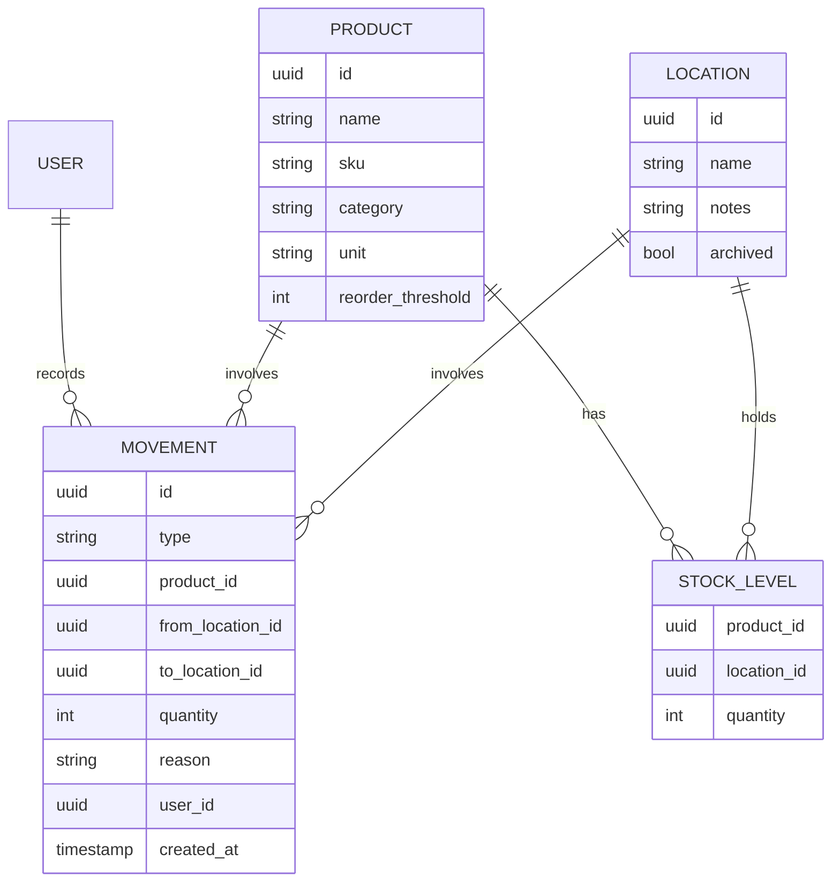
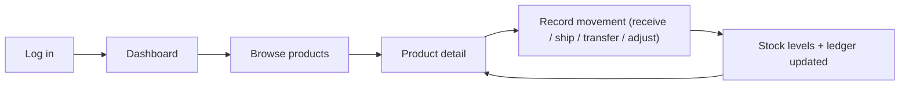

# StockFlow — Product Requirements Document (MVP)

## 1. Overview

**Product:** StockFlow — a web-based inventory management application.

**Target user:** Warehouse and distribution teams that track bulk inventory across multiple physical locations (warehouses, storage zones, distribution centers).

**Problem:** Warehouse teams often rely on spreadsheets or fragmented tools that can't accurately reflect stock levels across multiple locations in real time. This leads to stockouts, overstocking, mis-shipments, and time wasted reconciling counts.

**Solution (MVP):** A single source of truth for inventory that tracks every item's quantity per location, records stock movements (receive, transfer, adjust, ship), and gives the team an at-a-glance view of what's where.

**MVP goal:** Let a warehouse team manage products across multiple locations and trust that on-screen quantities match reality.

## 2. Goals & Non-Goals

**Goals**

- Track products and their quantities accurately across multiple locations.
- Record all stock movements with a full audit trail.
- Support inter-location transfers.
- Provide fast search and filtering of inventory.

**Non-Goals (explicitly out of scope for MVP)**

- Barcode/SKU scanning hardware integration.
- Purchase orders & supplier management.
- Advanced analytics/reporting dashboards.
- Roles & granular permissions (single shared team role for MVP).
- E-commerce / accounting integrations (Shopify, QuickBooks, etc.).
- Mobile native apps (responsive web only).

## 3. Target Users & Personas

- **Warehouse Operator** — receives shipments, picks/ships stock, performs counts. Needs fast, low-friction quantity updates.
- **Warehouse Manager** — oversees stock health across all locations, initiates transfers, reviews movement history.

For the MVP, all authenticated users share the same permission level.

## 4. Key User Stories

- As an operator, I can add a new product with its details and starting quantity at a location.
- As an operator, I can receive stock into a location, increasing its quantity.
- As an operator, I can ship/remove stock from a location, decreasing its quantity.
- As a manager, I can transfer stock from one location to another in a single action.
- As a manager, I can adjust a quantity (e.g., after a physical count) and record the reason.
- As any user, I can search/filter products and see quantity per location and total on hand.
- As any user, I can view the movement history for any product.

## 5. Functional Requirements

### 5.1 Authentication

- Email + password sign-up and login.
- Single team/workspace per account (no multi-tenant org switching in MVP).
- Session-based access; all pages require login.

### 5.2 Locations

- Create, edit, archive locations (name, address/notes).
- Each location holds independent quantities of products.

### 5.3 Products (Items)

- Fields: name, SKU (unique), description, category, unit of measure, reorder threshold (optional), image (optional).
- Create, edit, archive products.
- A product can exist at multiple locations, each with its own quantity.

### 5.4 Stock Movements

All quantity changes go through a movement record (immutable audit log):

- **Receive** — add stock to a location.
- **Ship/Issue** — remove stock from a location.
- **Transfer** — move stock from source location to destination location (atomic).
- **Adjust** — set/correct a quantity with a required reason (count correction, damage, loss).

Each movement stores: type, product, location(s), quantity delta, reason/note, user, timestamp.

### 5.5 Inventory Views

- **Product list:** searchable/filterable table (by name, SKU, category, location), showing total on-hand and per-location breakdown.
- **Product detail:** per-location quantities + full movement history.
- **Location detail:** all products and quantities at that location.
- **Low-stock indicator:** flag products at/below reorder threshold (visual only in MVP).

### 5.6 Dashboard (lightweight)

- Total SKUs, total units on hand, number of locations, count of low-stock items.

## 6. Data Model (high level)

`STOCK_LEVEL` (quantity per product per location) is the derived current state; `MOVEMENT` is the immutable ledger. Quantities are always computed/validated against the ledger to keep them trustworthy.

## 7. Core User Flow

## 8. Non-Functional Requirements

- **Accuracy:** transfers and adjustments must be atomic; no negative quantities allowed.
- **Performance:** product list loads < 1s for up to ~10k SKUs.
- **Responsive web:** usable on tablet/desktop in a warehouse setting.
- **Auditability:** every quantity change is attributable to a user and timestamp.
- **Data safety:** movements are immutable; corrections create new adjustment records.

## 9. Tech Stack

- **Frontend:** React + TypeScript (matches the existing `index.tsx` in the repo), bundled with Webpack, styled with styled-components.
  - **Forms:** React Hook Form.
  - **UI primitives:** Radix UI.
  - **Server state / data fetching:** TanStack Query (React Query).
  - **Tables:** TanStack Table.
- **Backend:** NestJS (TypeScript) exposing a REST API.
- **Database:** PostgreSQL, accessed via Prisma ORM.
- **Auth:** session or JWT-based email/password.

## 10. Success Metrics

- Inventory accuracy: on-screen quantity matches physical count in spot checks (target > 98%).
- Time to record a movement < 15 seconds.
- Weekly active warehouse users (adoption).
- Reduction in stockout incidents after adoption.

## 11. Milestones

1. **M1 – Foundations:** auth, locations, products CRUD.
2. **M2 – Inventory core:** stock levels + receive/ship/adjust movements with ledger.
3. **M3 – Multi-location:** transfers + per-location views.
4. **M4 – Visibility:** search/filter, product/location detail, dashboard, low-stock flags.

## 12. Open Questions

- Unit-of-measure conversions (e.g., cases vs. eaches) — needed in MVP or later?
- Should archived products/locations retain historical movements in views?
- Concurrency: how to handle two users editing the same stock level simultaneously?
